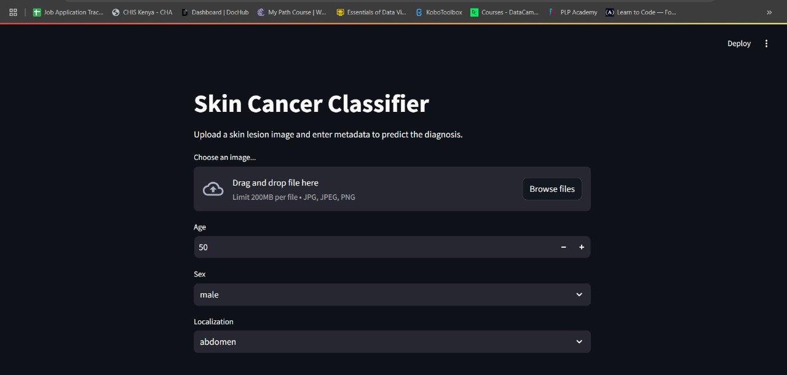

# Skin Cancer Classifier (HAM10000)



## Overview
The HAM10000 dataset addresses a critical challenge in automated diagnosis of pigmented skin lesions: the small size and lack of diversity of available dermatoscopic image datasets. This comprehensive collection provides researchers and practitioners with a robust training set for academic machine learning purposes.
This project provides a deep learning-based web app for classifying pigmented skin lesions using the [HAM10000 dataset](https://www.kaggle.com/datasets/kmader/skin-cancer-mnist-ham10000). The app combines image analysis with patient metadata (age, sex, localization) for improved diagnostic accuracy.

**Try the app live:**  
[https://skin-classifier.streamlit.app/](https://skin-classifier.streamlit.app/)

---

## Table of Contents

- [Skin Cancer Classifier (HAM10000)](#skin-cancer-classifier-ham10000)
  - [Overview](#overview)
  - [Table of Contents](#table-of-contents)
  - [Project Structure](#project-structure)
  - [Dataset](#dataset)
  - [Model Architecture](#model-architecture)
  - [How to Run Locally](#how-to-run-locally)
  - [Model File Handling](#model-file-handling)
  - [Usage](#usage)
  - [Results \& Evaluation](#results--evaluation)
  - [Citation](#citation)
  - [References](#references)
  - [Contributors](#contributors)

---

## Project Structure

```
.
├── app.py                # Streamlit web app
├── index.ipynb           # Model training and exploration notebook
├── requirements.txt      # Python dependencies
├── runtime.txt           # Python version for deployment
├── .gitignore
├── README.md
└── (model files not tracked in git)
```

---

## Dataset

- **HAM10000**: Human Against Machine with 10,000 training images.
- **Images**: 10,015 dermatoscopic images of pigmented lesions.
- **Metadata**: Age, sex, localization, and diagnostic labels.
- **Diagnostic Categories**:
  - Actinic keratoses (akiec)
  - Basal cell carcinoma (bcc)
  - Benign keratosis-like lesions (bkl)
  - Dermatofibroma (df)
  - Melanoma (mel)
  - Melanocytic nevi (nv)
  - Vascular lesions (vasc)

See [dataset description](https://www.kaggle.com/datasets/kmader/skin-cancer-mnist-ham10000) for more details.

---

## Model Architecture

- **HybridModel**: Combines a CNN (ResNet50) for image features with a fully connected network for metadata.
- **Inputs**: Dermatoscopic image + patient metadata (age, sex, localization).
- **Outputs**: Probability distribution over 7 diagnostic classes.

**Training details and code are available in [`index.ipynb`](./index.ipynb).**

---

## How to Run Locally

1. **Clone the repository:**
    ```sh
    git clone https://github.com/yourusername/AI-for-software-Engineering-Week-2.git
    cd AI-for-software-Engineering-Week-2
    ```

2. **Install dependencies:**
    ```sh
    pip install -r requirements.txt
    ```

3. **Download the trained model file:**
    - Download `best_model.pth` from [Google Drive](https://drive.google.com/uc?export=download&id=1EnwjeXfYCrnqTiKffmX_bCH0AtiBRfwE) or your provided link.
    - Place it in the project root directory.

4. **Run the Streamlit app:**
    ```sh
    streamlit run app.py
    ```

---

## Model File Handling

- **Note:** Model files (`.pth`) are not tracked in git due to size limits.
- The app will attempt to download the model file automatically if not present, using a public link.
- You can also manually place `best_model.pth` in the project root.

---

## Usage

1. **Upload a dermatoscopic image** (JPG/PNG).
2. **Enter patient metadata**: Age, sex, and lesion localization.
3. **Click "Run"** to get the predicted diagnosis and class probabilities.

---

## Results & Evaluation

- The model achieves strong performance on the HAM10000 validation set.
- For fair comparison, evaluate your method on the official test set via the challenge website.
- See [`index.ipynb`](./index.ipynb) for training metrics, confusion matrix, and further analysis.

---

## Citation

If you use this project or the HAM10000 dataset in your research, please cite:

> Tschandl, P., Rosendahl, C., & Kittler, H. (2018). The HAM10000 dataset, a large collection of multi-source dermatoscopic images of common pigmented skin lesions. *Scientific Data*, 5, 180161.

---

## References

- [HAM10000 Dataset on Kaggle](https://www.kaggle.com/datasets/kmader/skin-cancer-mnist-ham10000)
- [Official Challenge Website](https://challenge2018.isic-archive.com/)
- [Streamlit Documentation](https://docs.streamlit.io/)

---

## Contributors

- [Brian Ouko](https://github.com/WellBrian)  
- [Mmabatho Naseba](https://github.com/Mmabatho)  
- [Adebomi O. Isaiah](https://github.com/holuwercheyy)
- [Lukhanyo Mzanywa](https://github.com/Luu-17)
- [Letshego Sephiri](https://github.com/CaramelF)


*For questions or contributions, please open an issue or pull request*


